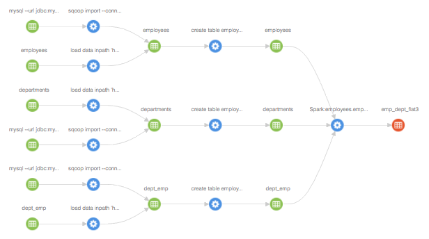
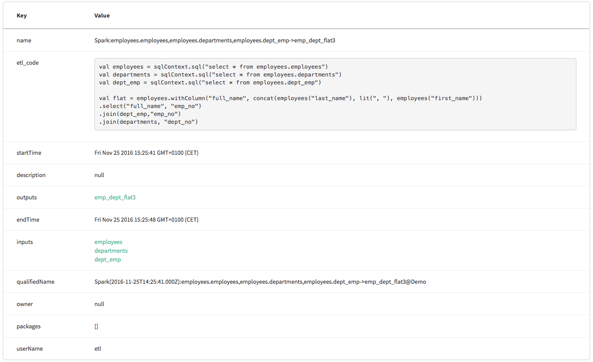

## Spark as ETL
If we use Saprk as ETL tool, no lineage information will be written to Atlas.

Assume we want to combine three Hive tables to an un-normalized flat one. A Spark code could look like (more details in [spark-etl.scala](spark-etl.scala)):

```scala
val employees = sqlContext.sql("select * from employees.employees")
val departments = sqlContext.sql("select * from employees.departments")
val dept_emp = sqlContext.sql("select * from employees.dept_emp")

val flat = employees.withColumn("full_name", concat(employees("last_name"), lit(", "), employees("first_name"))).
                     select("full_name", "emp_no").
                     join(dept_emp,"emp_no").
                     join(departments, "dept_no")

flat.registerTempTable(tempTable)
sqlContext.sql(s"create table default.employees_flat3 stored as ORC as select * from ${tempTable}")
```

## Adding Lineage

From a lineage perspective, "employees_flat3" is derived from the other threee tables.

The jupyter notebook [StoreSparkLineage.ipynb](StoreSparkLineage.ipynb) shows how to add this information to Atlas using the REST API

### Lineage Graph 



### Atlas view of the Spark Processor

